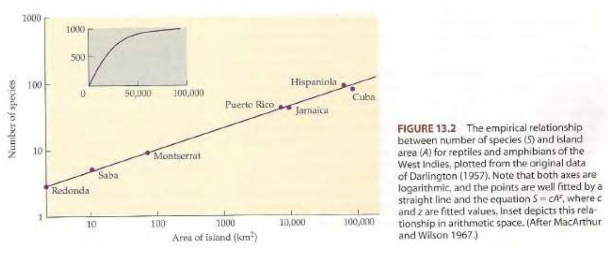
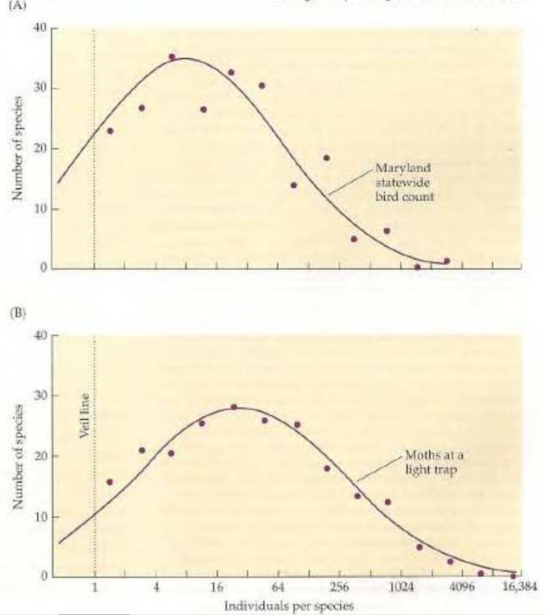
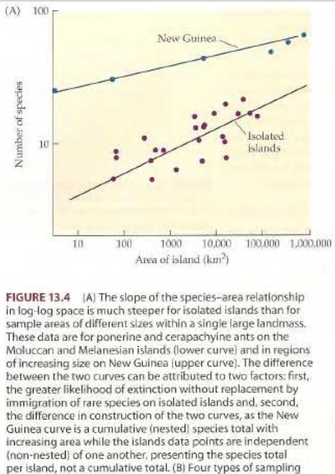

```{r setup, include=FALSE}
knitr::opts_chunk$set(echo = FALSE)
```

<!-- # Biogeografía insular: <br> patrones de riqueza de especies -->

# Introducción

## 

- ¿__Por qué__ estudiar islas en biogeografía?

- Como otros lugares, su __aislamiento y tamaño__ es idóneo para desarrollar experimentos.

- La __diversidad de tamaño y aislamiento__ en archipiélagos tiene un efecto similar a cuando manipulamos variables en el laboratorio.

- Además, __algunas islas pueden ser muy pequeñas__, lo que da lugar a realizar verdaderos experimentos en ellas, sin olvidar que esto provoca un fuerte impacto en la biodiversidad.

## ¿De dónde viene la biogeografía insular?

- La __colonización de las islas, sobre todo por plantas__, generaron fascinación a quienes realizaron viajes de exploración desde el siglo XIX (Wallace, Darwin, Dalton Hooker). Muchas ideas se quedaron en hipótesis.

- En el s. XX, la __integración de conceptos ecológicos y evolución__, alimentaron la discusión sobre biogeografía insular.

- El trabajo sobre la teoría de equilibrio en biogeografía de islas, de Robert H. MacArthur y Edward O. Wilson [@macarthur1963equilibrium; @wilson1967theory].

## ¿De dónde viene la biogeografía insular?

- MacArthur se especializó en competencia y coexistencia, mientras que Wilson se especializó en sistemática y biogeografía.

- El primero trabajaba inicialmente con aves, mientras que Wilson se dedicó a las hormigas. Ambos tenían experiencia en ambientes aislados (montañas, islas).

- MacArthur murió de cáncer a los 42 años (1972), pero hizo múltiples contribuciones en estudios de población y ecología de comunidades.

## ¿De dónde viene la biogeografía insular?

- Hasta MacArthur y Wilson, el énfasis había sido puesto en cómo habían sido colonizadas las islas y las posibles conexiones con el continente.

- El debate se centraba en relictos o "productos" de la evolución in situ. Es decir, __el debate principal era el origen o la procedencia de los organismos__.

- MacArthur y Wilson, con su teoría del equilibrio, __se apartaron de las preguntas y problemas tradicionales sobre historia natural__, plantearon nuevas preguntas y fueron capaces de responderlas.

# Patrones insulares

## Patrones insulares

- Dos patrones tradicionales en biogeografía fueron aprovechados por MacArthur y Wilson:

  - El número de especies crece con el tamaño de la isla (__relación especies-área__).
  - El número de especies disminuye con el aislamiento (__relación especies-aislamiento__).

## Patrones insulares

- Una fuente adicional de inspiración provino del trabajo de Wilson con hormigas: __la extinción y la colonización__ ("inmigración" en la traducción literal) eran fenómenos muy frecuentes, incluso en "escalas de tiempo ecológico".

- Esta fuente adicional trajo consigo los planteamientos sobre el __reemplazo de especies__

## Patrones insulares

- @arrhenius1921species propuso una primera __generalización matemática__ de la relación especies-area.

- La idea de Arrhenius era disponer de una __herramienta para comparar la diversidad entre islas__ (también explorar asociaciones entre especies, e.g. fitosociología).

- $S=cA^z$ => $log(S)=log(c) + zlog(A)$

  - donde $S$ es la riqueza de especies, $c$ es una constante (debe estimarse), $A$ área de la isla, y $z$ es la pendiente (también debe estimarse) que representa la pendiente de la recta al graficar la función en ejes logarítmicos

## 

## Patrones insulares

- @gleason1922relation, relación semilogarítmica, usada en ecología de plantas.

- $S= d + klog(A)$,

  - donde $S$ es la riqueza, $d$ el intercepto, $k$ la pendiente cuando $S$ es representada contra el logaritmo del área ($A$).
  
## Patrones insulares

- @preston1948commonness, "en cualquier área, sólo unas pocas especies son muy comunes (dominantes), mientras que la mayoría de las especies son moderadamente raras o raras del todo"

- Distribución log-normal o "canónica".

- La línea de velo aparece porque no se ha muestreado lo suficiente como para que las especies raras estén debidamente representadas.

## {width=65%}

## Patrones insulares

- Preston también sugirió que ...

  - ... **islas pequeñas y aisladas** tienen menos especies por unidad de superficie y **valores mayores del exponente $z$** de Arrhenius ... 
  
  - ... que lo que lo tienen **regiones de tamaño similar pero no aisladas**

## {width=52%}

## Patrones insulares

- Las observaciones de Preston fueron particularmente importantes porque vinculaban a __dos fenómenos__:

  - La __distribución abundancia por especies__ (SAD, también denominada distribución rango-abundancia).
  
  - La relación __especies-área__.

- Sus aportaciones sugerían que la __variabilidad en el aislamiento podía influir en la forma de la distribución rango-abundancia__.

# Referencias

##

<section style="font-size: 24px; text-align: left;">