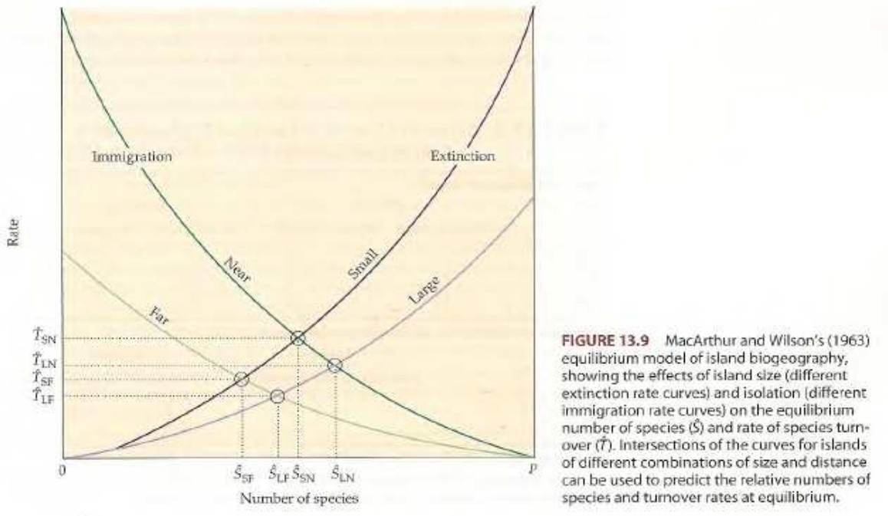

```{r setup, include=FALSE}
knitr::opts_chunk$set(echo = FALSE)
```

<!-- # Biogeografía insular: <br> patrones de riqueza de especies -->

# Introducción

## 

- ¿__Por qué__ estudiar islas en biogeografía?

- Como otros lugares, su __aislamiento y tamaño__ es idóneo para desarrollar experimentos.

- La __diversidad de tamaño y aislamiento__ en archipiélagos tiene un efecto similar a cuando manipulamos variables en el laboratorio.

- Además, __algunas islas pueden ser muy pequeñas__, lo que da lugar a realizar verdaderos experimentos en ellas, sin olvidar que esto provoca un fuerte impacto en la biodiversidad.

## ¿De dónde viene la biogeografía insular?

- La __colonización de las islas, sobre todo por plantas__, generaron fascinación a quienes realizaron viajes de exploración desde el siglo XIX (Wallace, Darwin, Dalton Hooker). Muchas ideas se quedaron en hipótesis.

- En el s. XX, la __integración de conceptos ecológicos y evolución__, alimentaron la discusión sobre biogeografía insular.

- El trabajo sobre la teoría de equilibrio en biogeografía de islas, de Robert H. MacArthur y Edward O. Wilson [@macarthur1963equilibrium; @wilson1967theory].

## ¿De dónde viene la biogeografía insular?

- MacArthur se especializó en competencia y coexistencia, mientras que Wilson se especializó en sistemática y biogeografía.

- El primero trabajaba inicialmente con aves, mientras que Wilson se dedicó a las hormigas. Ambos tenían experiencia en ambientes aislados (montañas, islas).

- MacArthur murió de cáncer a los 42 años (1972), pero hizo múltiples contribuciones en estudios de población y ecología de comunidades.

## ¿De dónde viene la biogeografía insular?

- Hasta MacArthur y Wilson, el énfasis había sido puesto en cómo habían sido colonizadas las islas y las posibles conexiones con el continente.

- El debate se centraba en relictos o "productos" de la evolución in situ. Es decir, __el debate principal era el origen o la procedencia de los organismos__.

- MacArthur y Wilson, con su teoría del equilibrio, __se apartaron de las preguntas y problemas tradicionales sobre historia natural__, plantearon nuevas preguntas y fueron capaces de responderlas.

# Patrones insulares

## Patrones insulares

- Dos patrones tradicionales en biogeografía fueron aprovechados por MacArthur y Wilson:

  - El número de especies crece con el tamaño de la isla (__relación especies-área__).
  - El número de especies disminuye con el aislamiento (__relación especies-aislamiento__).

## Patrones insulares

- Una fuente adicional de inspiración provino del trabajo de Wilson con hormigas: __la extinción y la colonización__ ("inmigración" en la traducción literal) eran fenómenos muy frecuentes, incluso en "escalas de tiempo ecológico".

- Esta fuente adicional trajo consigo los planteamientos sobre el __reemplazo de especies__

## Patrones insulares

- @arrhenius1921species propuso una primera __generalización matemática__ de la relación especies-area.

- La idea de Arrhenius era disponer de una __herramienta para comparar la diversidad entre islas__ (también explorar asociaciones entre especies, e.g. fitosociología).

- $S=cA^z$ => $log(S)=log(c) + zlog(A)$

  - donde $S$ es la riqueza de especies, $c$ es una constante (debe estimarse), $A$ área de la isla, y $z$ es la pendiente (también debe estimarse) que representa la pendiente de la recta al graficar la función en ejes logarítmicos

## 

## Patrones insulares

- @gleason1922relation, relación semilogarítmica, usada en ecología de plantas.

- $S= d + klog(A)$,

  - donde $S$ es la riqueza, $d$ el intercepto, $k$ la pendiente cuando $S$ es representada contra el logaritmo del área ($A$).
  
## Patrones insulares

- @preston1948commonness, "en cualquier área, sólo unas pocas especies son muy comunes (dominantes), mientras que la mayoría de las especies son moderadamente raras o raras del todo"

- Distribución log-normal o "canónica".

- La línea de velo aparece porque no se ha muestreado lo suficiente como para que las especies raras estén debidamente representadas.

## {width=65%}

## Patrones insulares

- Preston también sugirió que ...

  - ... **islas pequeñas y aisladas** tienen menos especies por unidad de superficie y **valores mayores del exponente $z$** de Arrhenius ... 
  
  - ... que lo que lo tienen **regiones de tamaño similar pero no aisladas**

## {width=52%}

## Patrones insulares

- Las observaciones de Preston fueron particularmente importantes porque vinculaban a __dos fenómenos__:

  - La __distribución abundancia por especies__ (SAD, también denominada distribución rango-abundancia).
  
  - La relación __especies-área__.

- Sus aportaciones sugerían que la __variabilidad en el aislamiento podía influir en la forma de la distribución rango-abundancia__.

## Patrones insulares

- Por otra parte, además de la relación especies-área, MacArthur y Wilson analizaron de forma **crítica y cuantitativa, la relación especies-aislamiento**

- Esta relación (**especies-aislamiento**) era, en la época (y actualmente de hecho), menos conocida.

- $S= k_1e^{-k_2(I)}$,

- donde $k_1$ y $k_2$ son coeficientes a estimar e $I$ es el aislamiento.

## 

## {width=75%}

## Patrones insulares

- Múltiples problemas afectan a la forma de medir el aislamiento:

  - ¿Distancia a isla próxima?
  - ¿Distancia a continente?
  - ¿Distancia a isla que pueda actuar como fuente?
  - ¿Qué tal el papel de las aves migratorias o de los vientos/corrientes?

- De todas formas, MacArthur y Wilson debían ser fieles al patrón bien conocido a la fecha de que, una vez la riqueza es estandarizada en función del área, **las islas remotas tienen menos especies**".

## Patrones insulares

- Finalmente, el último patrón de la biota insular, es el denominado __reemplazo de especies__.

- En trabajos con hormigas de la Melanesia, Wilson había notado cómo __determinadas especies__, en su propagación desde el continente hacia la isla de Nueva Guinea, y hacia las islas más remotas y pequeñas de la Melanesia, __se excluían unas a otras por medio de competencia__.

- MacArthur y Wilson usaron esta y otra evidencia (e.g. Krakatoa), para demostrar que los episodios de colonización eran rápidos y recurrentes, por lo que el establecimiento de nuevas especies debía tener algún tipo de control adicional, y este era el __reemplazo de especies__.

# Teoría del equilibrio de la biogeografía insular, TEBI

## Teoría del equilibrio de la biogeografía insular

Algunos conceptos básicos definidos dentro de la TEBI:

<section style="font-size: 32px; text-align: left;">

- Colonización: la **persistencia** relativamente prolongada de una especie inmigrante en una isla (reproducción + aumento población).

- Extinción: **desaparición** total de una *especie* en una isla (puede existir "recolonización").

- Inmigración: proceso de __llegada__ de un propágulo a una isla no ocupada previamente por esta especie (no importa por cuánto tiempo permanezca).

- Propágulo: __número mínimo de individuos__ de una especie, capaces de colonizar una isla habitable.

</section>

## {width=55%}

## Teoría del equilibrio de la biogeografía insular

- La TEBI explicaba, en un único postulado, las tres características básicas de la biota insular: la relación especies-area, la relación especies-aislamiento, y el reemplazo de especies.

- El modelo de equilibrio se representa graficando las tasas de inmigración y extinción como una función del número de especies (*S*).

- *S* puede variar desde 0 hasta un máximo hipotético *P*.

- *P* es el número de especies que está disponible para colonizar la isla desde un área "proveedora" de especies (continente u otra isla, en inglés *species pool*).

## 

## Teoría del equilibrio de la biogeografía insular

- Considérense una __isla vacía__ (escenario ideal), y evalúense las formas de las curvas que representan las __tasas de extinción e inmigración__.

- La __tasa de inmigración__ (número de propágulos por unidad de tiempo que llegan a la isla, no presentes en esta) __disminuye__ desde un valor máximo (si la isla está vacía, será un valor razonablemente elevado) hasta alcanzar un cero teórico si la isla llegara a contener el mismo número de especies que el área fuente o *pool*.

## Teoría del equilibrio de la biogeografía insular

- Por el contrario, la __tasa de extinción__ (número de especies presentes en la isla que desaparecen) experimenta un __aumento gradual__ desde 0 (sin especies en la isla nada puede extinguirse) hasta alcanzar valores elevados en la medida que el número de especies aumenta, dado que __más y más especies tendrán poblaciones cada vez más pequeñas__ y, por lo tanto, serán más vulnerables a la extinción.

- Este modelo asume el argumento de que la isla tiene una __capacidad de carga fija__ en el tiempo.

## Teoría del equilibrio de la biogeografía insular

- Para el eje de abscisas, en un valor entre 0 y *P* especies, las __curvas de las tasas de extinción e inmigración se cortarán__.

- En el eje de ordenadas, en este punto, ambas tasas, __inmigración y extinción, serán exactamente iguales__.

- De esta forma, se obtiene un __número de especies equilibrado o balanceado $\hat{S}$, y una tasa de equilibrio de reemplazo de especies $\hat{T}$__.

## Teoría del equilibrio de la biogeografía insular

- El __punto representa un equilibrio estable__, por lo que si el número de especies es __aumentado ($S''$) o disminuido ($S'$)__ respecto de $\hat{S}$ (por ejemplo, debido a un huracán, cambio del clima, intervención antrópica, etc.), la teoría sugiere que __se alcanzará nuevamente el número de equlibrio $\hat{S}$__.

- Ahora incorporemos el __efecto de aislamiento y tamaño__ de las islas al modelo.

## 

## Fortalezas y debilidades de la teoría del equilibrio

- Algunas fortalezas:

  - Se impulsó una __nueva corriente de investigación en biogeografía ecológica__ enfocada en islas y en otras áreas con características de aislamiento.

  - La __representación gráfica__ de la teoría contribuyó mucho a su difusión y comprensión.

  - El modelo __predice tendencias cualitativas__ en disminución o aumento de especies y tasas de reemplazo para distintos tamaños de islas y grados de aislamiento.

## Fortalezas y debilidades de la teoría del equilibrio

- Algunas debilidades:

  - __Simplismo__. Oculta patrones y procesos que tienen lugar en la biogeografía de islas. No obstante, sus autores argumentaron en su momento que todo modelo sacrifica algo de precisión en favor de claridad y generalización.

  - __Limitación para predicciones cuantitativas precisas__. Las curvas de extinción e inmigración no están del todo bien estudiadas como para producir generalizaciones que permitan este tipo de predicciones.

## Fortalezas y debilidades de la teoría del equilibrio

- Algunas debilidades:
  
  - La __separación artificial entre inmigración y extinción__.
  
  - Las curvas de extinción e inmigración, casi con total seguridad, __no son iguales para distintos grupos de organismos ni para todas las islas__ (por ejemplo, en distintas condiciones de aislamiento o tamaño, no necesariamente se producen las formas teóricas sugeridas por los autores), y __no son estables en el tiempo__ (las curvas cambian en tiempo geológico).
  
  - Se ignora la __especiación__.

## {width=55%}

# Referencias

##

<section style="font-size: 24px; text-align: left;">